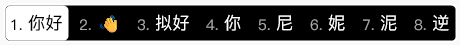
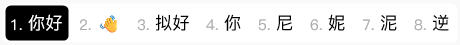

# easy-configs-rime

小狼毫输入法设置

# 参考

配置参考： [雾凇拼音](https://github.com/iDvel/rime-ice)

配色参考：[Rime 鼠须管输入法皮肤实验室](https://www.figma.com/community/file/1166934605535869911/rime)

# 主题截图

在 Windows 上，加载 `weasel.custom.yaml` 配置后的部分主题如下所示：

- BlueDark

- BlueLight

- DarkgreyLight

- GreenLight (仿微信输入法)

- GreyLight

- MacOSLight (仿 MacOS)

- PinkDark

- PurpleLight

- TaiJiDark

- TaiJiLight

- Yellow-Dark

