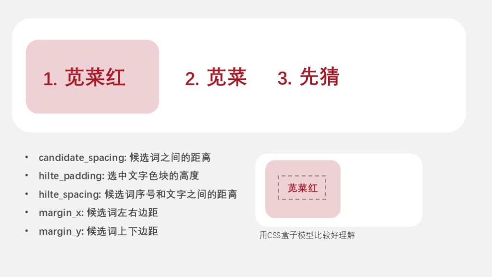

# easy-configs-rime

小狼毫输入法设置

# 参考

配置参考： [雾凇拼音](https://github.com/iDvel/rime-ice)

配色参考：[Rime 鼠须管输入法皮肤实验室](https://www.figma.com/community/file/1166934605535869911/rime)，预览图如下：


# 主题截图

在 Windows 上，加载 `legacy/weasel.custom.yaml` 配置后的部分主题如下所示：

- 蓝色·暗


- 蓝色·亮


> P.S. my favorite~

- 深灰·亮（darkgrey-light）


- 绿色·亮（green-light）


- 灰色·亮（grey-light）


- MacOS·亮 (macos-light)


- 粉色·暗（pink-dark）


- 紫色·亮（purple-light）


- 黑白·暗（taiji-dark）


- 黑白·亮（taiji-light）


- 黄色·暗（yellow-dark）


# "中国色"主题

## 设计原则

对于亮色主题，遵循的设计原则：

- 背景色：`#FFFFFF`
- 候选字颜色： `#454545`
- 标签（未选中）颜色： `#8E8E8E`
- 候选字（选中）文字颜色：根据个人喜好选择
- 候选字（选中）背景颜色：`候选字（选中）文字 颜色`不透明度 20%（Alpha 的值约为 38/0x26）
- 标签（选中）颜色：和候选字（选中）文字颜色保持一致

对于暗色主题，遵循的设计原则：

- 背景色：`#000000`
- 候选字颜色： `#454545` 的反色 `#BABABA`
- 标签（未选中）颜色： `#8E8E8E` 的反色 `#717171`
- 候选字（选中）文字颜色：`#000000`
- 候选字（选中）背景颜色：亮色主题中`候选字（选中）背景颜色`
- 标签（选中）颜色：和候选字（选中）文字颜色保持一致

## 主题示例

以下是根据 [中国色](https://www.zhongguose.com) 和上述设计原则做出来的部分主题的截图（`chinese-colors/weasel.custom.yaml`）：

- 薄荷绿

  

- 薄荷绿·暗

  

- 靛青

  

- 靛青·暗

  

- 高粱红

  

- 高粱红·暗

  

- 古铜褐

  

- 古铜褐·暗

  

- 苋菜紫

  

- 苋菜紫·暗

  

P.S. `chinese-colors/weasel.custom.yaml` 文件是根据 `scripts/colors.json` 生成的，⚠️ 主题巨多！⚠️ 择优采用！

## 一键生成配置

在 `scripts/colors.csv` 文件里，每行表示一种配色方案，格式为： `配色 RGB 16进制值,配色英文名,配色中文名`

### 方式1: 使用 `scripts/generate.py`

- 前置要求：python 3
- 使用方式：
  - 将 `scripts/colors.csv` 和 `scripts/generate.py`保存到本地
  - 保存路径打开终端，运行 `python generate.py`

### 方式2: 使用 `scripts/Generate.java`

- 前置要求: JDK 15+ （使用了文本块语法）
- 使用方式：
  - 将 `scripts/colors.csv` 和 `scripts/Generate.class` 保存到本地
  - 保存路径打开终端，运行 `java Generate` (或者自己编译 `Generate.java` 文件)

经过上述两种方式，均可生成 `weasel.custom.yaml` 文件，拷贝到 Rime 用户文件夹中即可

### 方式3: 使用远程脚本

```shell
Set-ExecutionPolicy -ExecutionPolicy RemoteSigned -Scope CurrentUser
Invoke-WebRequest -Uri "https://raw.githubusercontent.com/rxhaol/easy-configs-rime/refs/heads/main/scripts/install.ps1" -UseBasicParsing | Select-Object -ExpandProperty Content | Invoke-Expression
```

这种方式会自动生成 `weasel.custom.yaml` 并拷贝到 `$env:appdata/rime` 文件夹下，如果更改了 rime 用户文件夹位置，建议不要直接使用脚本，可以 clone 本仓库代码更改 `install.ps1` 的目标文件的位置再手动执行本地脚本。

## 在线网站

如果想要实时预览和选择想要的颜色，这个 [网页](https://rxhaol.github.io/easy-configs-rime/) 满足基本需求。

## 自助调整

如果希望对外观进行调整，可以参考下图更改生成的配置文件的 `style/layout` 节点:



# 其他资源

- [传统色](https://colors.masantu.com/#/)

- [Adobe color wheel](https://color.adobe.com/zh/create/color-wheel)
