# easy-configs-rime

小狼毫输入法设置

# 参考

配置参考： [雾凇拼音](https://github.com/iDvel/rime-ice)

配色参考：[Rime 鼠须管输入法皮肤实验室](https://www.figma.com/community/file/1166934605535869911/rime)，预览图如下：

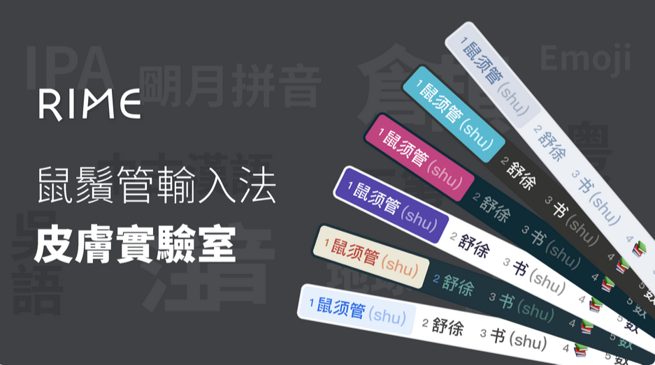

# 主题截图

在 Windows 上，加载 `legacy/weasel.custom.yaml` 配置后的部分主题如下所示：

- 蓝色·暗

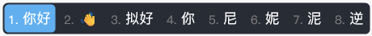

- 蓝色·亮

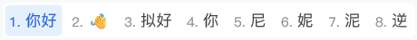

> P.S. my favorite~

- 深灰·亮（darkgrey-light）

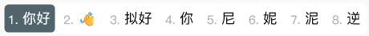

- 绿色·亮（green-light）

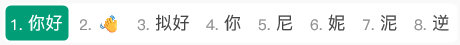

- 灰色·亮（grey-light）

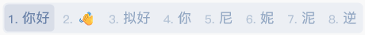

- MacOS·亮 (macos-light)

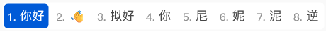

- 粉色·暗（pink-dark）

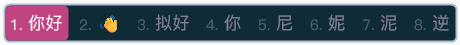

- 紫色·亮（purple-light）

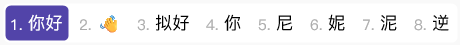

- 黑白·暗（taiji-dark）

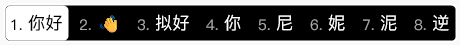

- 黑白·亮（taiji-light）

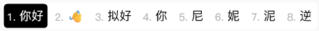

- 黄色·暗（yellow-dark）

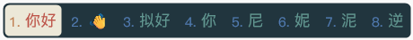

# 自定义主题

对于亮色主题，遵循的设计原则：

- 背景色：`#FFFFFF`
- 候选字颜色： `#454545`
- 标签（未选中）颜色： `#8E8E8E`
- 候选字（选中）文字颜色：根据个人喜好选择
- 候选字（选中）背景颜色：`候选字（选中）文字 颜色`不透明度 20%（Alpha 的值约为 38/0x26）
- 标签（选中）颜色：和候选字（选中）文字颜色保持一致

对于暗色主题，遵循的设计原则：

- 背景色：`#000000`
- 候选字颜色： `#454545` 的反色 `#BABABA`
- 标签（未选中）颜色： `#8E8E8E` 的反色 `#717171`
- 候选字（选中）文字颜色：`#000000`
- 候选字（选中）背景颜色：亮色主题中`候选字（选中）背景颜色`
- 标签（选中）颜色：和候选字（选中）文字颜色保持一致

以下是根据 [中国传统色](https://www.zhongguose.com) 和上述设计原则做出来的部分主题的截图（`chinese-colors/weasel.custom.yaml`）：

- 薄荷绿

  

- 薄荷绿·暗

  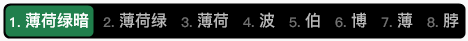

- 靛青

  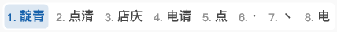

- 靛青·暗

  

- 高粱红

  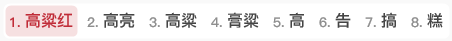

- 高粱红·暗

  

- 古铜褐

  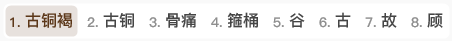

- 古铜褐·暗

  

- 苋菜紫

  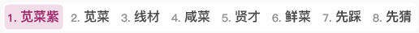

- 苋菜紫·暗

  

# 其他资源

- [传统色](https://colors.masantu.com/#/)

- [Adobe color wheel](https://color.adobe.com/zh/create/color-wheel)
