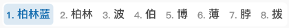
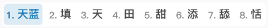
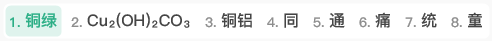
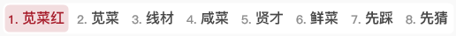
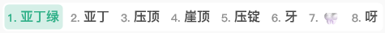

# easy-configs-rime

小狼毫输入法设置

# 参考

配置参考： [雾凇拼音](https://github.com/iDvel/rime-ice)

配色参考：[Rime 鼠须管输入法皮肤实验室](https://www.figma.com/community/file/1166934605535869911/rime)，预览图如下：

# 主题截图

在 Windows 上，加载 `legacy/weasel.custom.yaml` 配置后的部分主题如下所示：

- 蓝色.暗

- 蓝色.亮

> P.S. my favorite~

- 深灰.亮（darkgrey-light）

- 绿色.亮（green-light）

- 灰色.亮（grey-light）

- MacOS.亮 (macos-light)

- 粉色.暗（pink-dark）

- 紫色.亮（purple-light）

- 黑白.暗（taiji-dark）

- 黑白.亮（taiji-light）

- 黄色.暗（yellow-dark）

# 自定义主题

对于亮色主题，我本人比较喜欢的设计原则遵循：

- 背景色：`#FFFFFF`
- 候选字颜色： `#454545`
- 标签（未选中）颜色： `#8E8E8E`
- 候选字（选中）文字颜色：根据个人喜好选择
- 候选字（选中）背景颜色：`候选字（选中）文字`\*85%透明度（Alpha 的值约为 38/0x26）
- 标签（选中）颜色：和候选字（选中）文字颜色保持一致

以下是根据：[中国传统颜色](https://www.zhongguose.com) 和上述设计原则做出来的主题（`chinese-colors/weasel.custom.yaml`）：

- 柏林蓝

  

- 高粱红

  

- 蓝绿

  

- 天蓝

  

- 铜绿

  

- 苋菜红

  

- 苋菜紫

  

- 亚丁绿

  